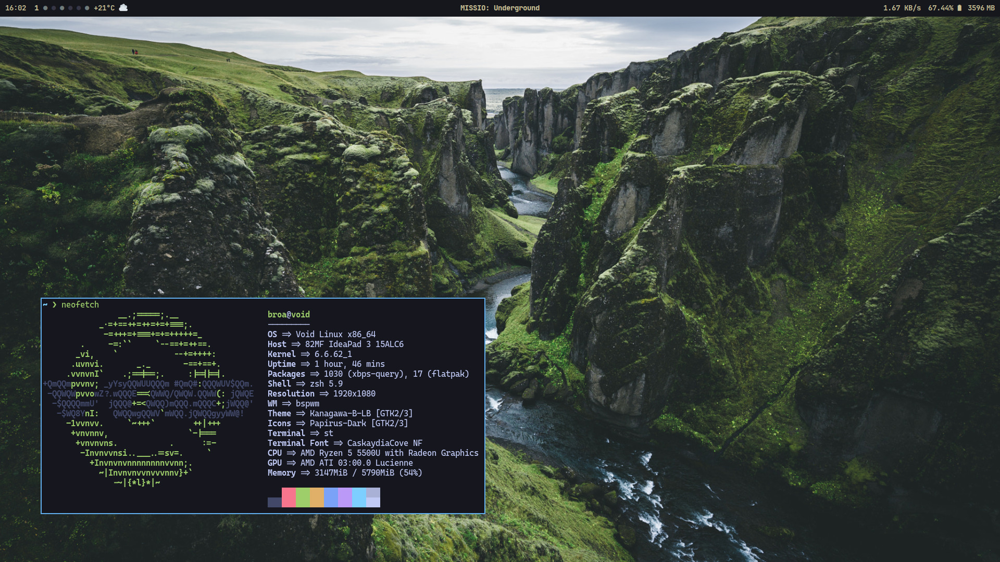
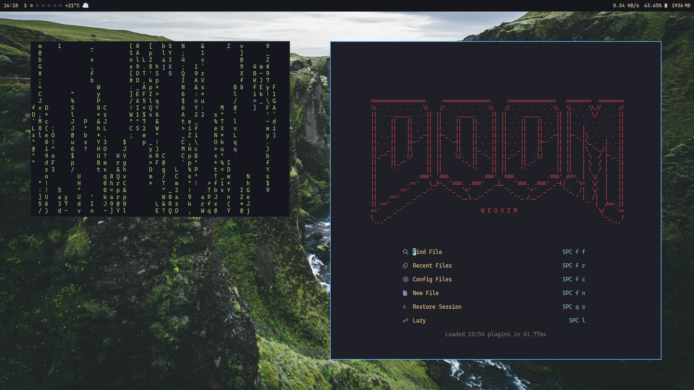
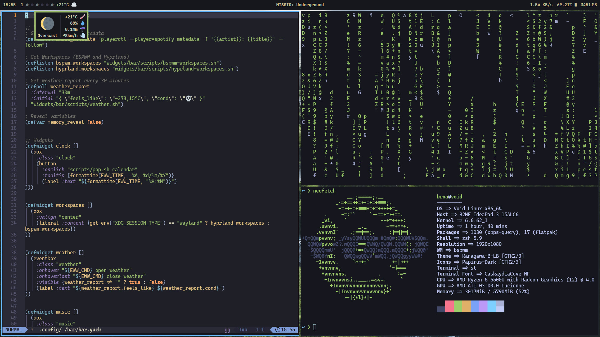
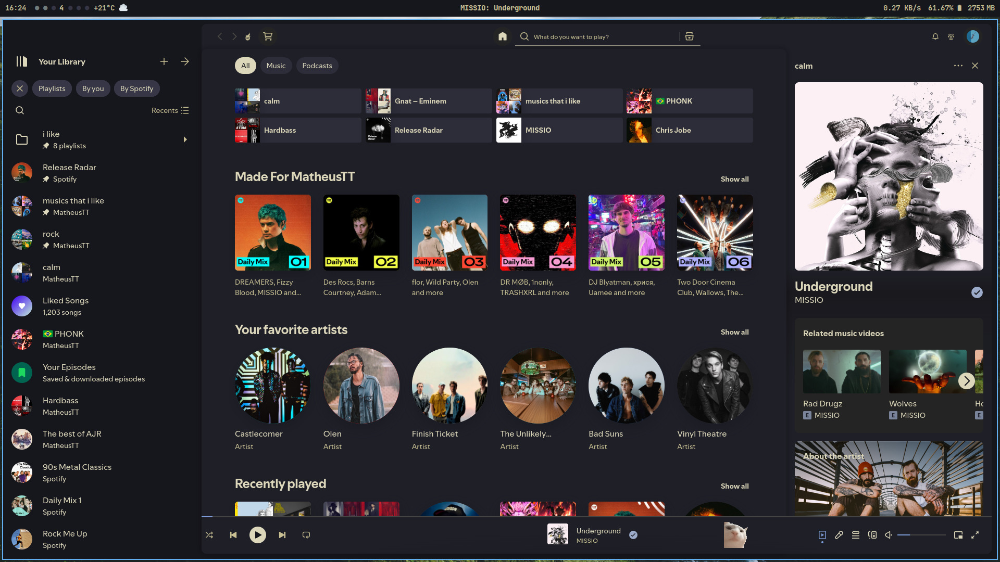

# dotfiles

Welcome to my dotfiles!


<details>
<summary>More Screenshots</summary>
  
  
  
</details>


These are my personal configurations for Linux, tailored to enhance productivity and streamline workflows.
They are designed to be lightweight, modular, and easy to manage.

## Features
- **Window Managers**: Configurations for Hyprland and BSPWM.
- **Development Tools**: Pre-configured for Python, Rust, Flutter, and more).
- **Automation**: Managed with [chezmoi](https://www.chezmoi.io/) for consistent setup across systems.

## Installation
1. Make sure you have `chezmoi` installed. You can install it by following the [official guide](https://www.chezmoi.io/install/).

2. Run the following command to initialize and apply my dotfiles:
  ```bash
  chezmoi init MatheusTT
  ```

  Review the changes (if necessary) and apply them:
  ```bash
  chezmoi apply
  ```

## Programs used
- Window Manager: [BSPWM](https://github.com/baskerville/bspwm)
- Wayland Compositor: [Hyprland](https://hyprland.org/)
- Xorg Terminal: [st](https://github.com/bakkeby/st-flexipatch)
- Wayland Terminal: [foot](https://codeberg.org/dnkl/foot)
- AppLauncher: [rofi](https://github.com/lbonn/rofi)
- Neovim Distro: [LazyVim](https://www.lazyvim.org/)
- GTK Theme: [Kanagawa](https://www.pling.com/p/1810560/)
- Icon Theme: [Papirus](https://github.com/PapirusDevelopmentTeam/papirus-icon-theme/)
- Cursor Theme: [cz-Hickson-Black](https://www.gnome-look.org/p/1503665)
- Fonts: JetBrains Mono, Caskaydia Cove (both [Nerd Fonts](https://www.nerdfonts.com/))

## Structure
- `.config/`: Contains configurations for window managers, terminal, and other applications.
- `.local/share/themes/` && `.local/share/icons/`: Houses cursor and theme files.
- `.local/bin/`: Simple scripts used across the entire system.
- `scripts/`: Custom scripts for automation and other tasks.

## Contributing
If you have suggestions or improvements, feel free to open an issue or submit a pull request.

## License
These dotfiles are provided as-is and are free to use or modify.
If you share them, a credit would be appreciated.

Enjoy!
